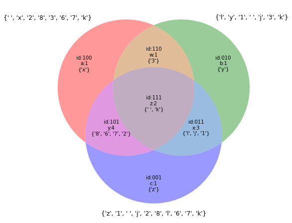
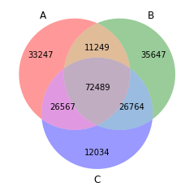
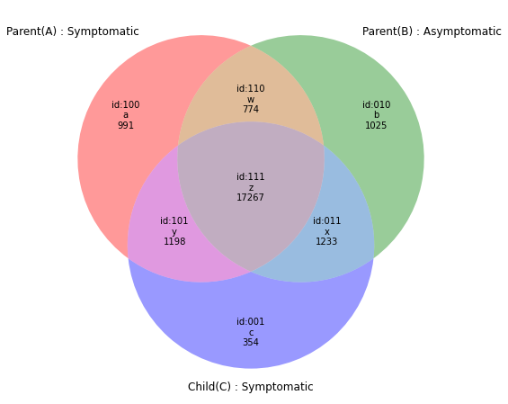
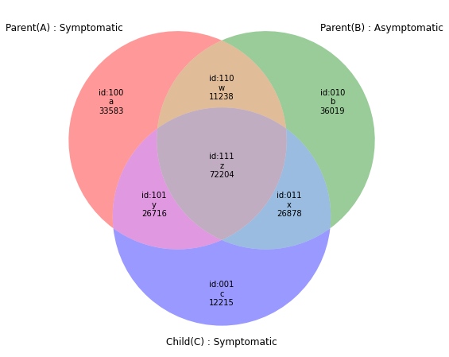
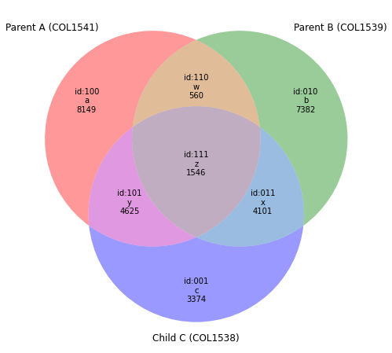

```python
import numpy as np
import pandas as pd 
import matplotlib.pyplot as plt
from matplotlib_venn import venn3_unweighted as venn3
```

# Extracting data


```python
from google.colab import drive
drive.mount('/content/gdrive', force_remount=True)
root_dir = "/content/gdrive/My Drive/idp-ego/GUI/algorithms/trio/"
data_dir = root_dir + 'data/'
```

    Go to this URL in a browser: https://accounts.google.com/o/oauth2/auth?client_id=947318989803-6bn6qk8qdgf4n4g3pfee6491hc0brc4i.apps.googleusercontent.com&redirect_uri=urn%3aietf%3awg%3aoauth%3a2.0%3aoob&response_type=code&scope=email%20https%3a%2f%2fwww.googleapis.com%2fauth%2fdocs.test%20https%3a%2f%2fwww.googleapis.com%2fauth%2fdrive%20https%3a%2f%2fwww.googleapis.com%2fauth%2fdrive.photos.readonly%20https%3a%2f%2fwww.googleapis.com%2fauth%2fpeopleapi.readonly
    
    Enter your authorization code:
    ··········
    Mounted at /content/gdrive


```python
# path = Path(base_dir + 'data/bears')
# dest.mkdir(parents=True, exist_ok=True) I want only existing folders

e1=pd.read_csv(data_dir+'COL1538-V4-2.csv',low_memory=0)
e1.head(5)

```


<div>
<table border="1" class="dataframe">
  <thead>
    <tr style="text-align: right;">
      <th></th>
      <th>chr</th>
      <th>pos</th>
      <th>ID</th>
      <th>refNt</th>
      <th>altNt</th>
      <th>function</th>
      <th>gene</th>
      <th>transcrptID</th>
      <th>is_CCDS</th>
      <th>is_RefSeq</th>
      <th>AAChange</th>
      <th>AnnoOther</th>
      <th>zygo</th>
      <th>BL</th>
      <th>gnomADGenomes_AF</th>
      <th>gnomADEx_AF</th>
      <th>ESP6500All_AF</th>
      <th>gnomADEx_AFR_AF</th>
      <th>gnomADEx_AMR_AF</th>
      <th>gnomADEx_EAS_AF</th>
      <th>gnomADEx_FIN_AF</th>
      <th>gnomADEx_NFE_AF</th>
      <th>gnomADEx_OTH_AF</th>
      <th>gnomADEx_SAS_AF</th>
      <th>MiddleEast_AF</th>
      <th>Sift_Pred</th>
      <th>Polyphen2HVAR_Pred</th>
      <th>CADD_Phred_V1.3</th>
      <th>MSC_99%</th>
      <th>MSC_99%_Pred</th>
      <th>GDI</th>
      <th>varQual</th>
      <th>AD</th>
      <th>DP</th>
      <th>MQ</th>
      <th>QD</th>
      <th>Clinvar_AlleleID</th>
      <th>KnownPID</th>
      <th>PredictedPID</th>
      <th>P-value</th>
      <th>Route</th>
      <th>gnomADGen_SegDup</th>
    </tr>
  </thead>
  <tbody>
    <tr>
      <th>0</th>
      <td>1</td>
      <td>13273</td>
      <td>rs531730856</td>
      <td>G</td>
      <td>C</td>
      <td>nc_mirna</td>
      <td>DDX11L1</td>
      <td>ENST00000456328</td>
      <td>no</td>
      <td>no</td>
      <td>NaN</td>
      <td>intron(DDX11L1:ENST00000518655);nc_mirna(DDX11...</td>
      <td>het</td>
      <td>no</td>
      <td>0.102748</td>
      <td>NaN</td>
      <td>NaN</td>
      <td>NaN</td>
      <td>NaN</td>
      <td>NaN</td>
      <td>NaN</td>
      <td>NaN</td>
      <td>NaN</td>
      <td>NaN</td>
      <td>NaN</td>
      <td>NaN</td>
      <td>NaN</td>
      <td>2.42</td>
      <td>NaN</td>
      <td>NaN</td>
      <td>NaN</td>
      <td>190</td>
      <td>13,11</td>
      <td>24</td>
      <td>25.1</td>
      <td>7.9</td>
      <td>NaN</td>
      <td>NO</td>
      <td>NO</td>
      <td>NaN</td>
      <td>NaN</td>
      <td>yes</td>
    </tr>
    <tr>
      <th>1</th>
      <td>1</td>
      <td>13417</td>
      <td>rs777038595</td>
      <td>C</td>
      <td>CGAGA</td>
      <td>nc_mirna</td>
      <td>DDX11L1</td>
      <td>ENST00000456328</td>
      <td>no</td>
      <td>no</td>
      <td>NaN</td>
      <td>intron(DDX11L1:ENST00000450305);nc_mirna(DDX11...</td>
      <td>het</td>
      <td>no</td>
      <td>0.066620</td>
      <td>0.112528</td>
      <td>NaN</td>
      <td>0.015301</td>
      <td>0.0</td>
      <td>0.055929</td>
      <td>0.175127</td>
      <td>0.128360</td>
      <td>0.134288</td>
      <td>0.156572</td>
      <td>NaN</td>
      <td>NaN</td>
      <td>NaN</td>
      <td>4.01</td>
      <td>NaN</td>
      <td>NaN</td>
      <td>NaN</td>
      <td>17</td>
      <td>10,2</td>
      <td>12</td>
      <td>27.8</td>
      <td>1.2</td>
      <td>NaN</td>
      <td>NO</td>
      <td>NO</td>
      <td>NaN</td>
      <td>NaN</td>
      <td>yes</td>
    </tr>
    <tr>
      <th>2</th>
      <td>1</td>
      <td>13656</td>
      <td>rs1263393206</td>
      <td>CAG</td>
      <td>C</td>
      <td>essential_splicing</td>
      <td>DDX11L1</td>
      <td>ENST00000518655</td>
      <td>no</td>
      <td>no</td>
      <td>NaN</td>
      <td>nc_mirna(DDX11L1:ENST00000456328);nc_mirna(DDX...</td>
      <td>het</td>
      <td>no</td>
      <td>0.489766</td>
      <td>0.029533</td>
      <td>NaN</td>
      <td>0.006352</td>
      <td>0.0</td>
      <td>0.003094</td>
      <td>0.061983</td>
      <td>0.048217</td>
      <td>0.030691</td>
      <td>0.035543</td>
      <td>NaN</td>
      <td>NaN</td>
      <td>NaN</td>
      <td>5.77</td>
      <td>NaN</td>
      <td>NaN</td>
      <td>NaN</td>
      <td>35</td>
      <td>4,2</td>
      <td>6</td>
      <td>23.5</td>
      <td>5.8</td>
      <td>NaN</td>
      <td>NO</td>
      <td>NO</td>
      <td>NaN</td>
      <td>NaN</td>
      <td>yes</td>
    </tr>
    <tr>
      <th>3</th>
      <td>1</td>
      <td>15211</td>
      <td>rs78601809</td>
      <td>T</td>
      <td>G</td>
      <td>intron</td>
      <td>WASH7P</td>
      <td>ENST00000438504</td>
      <td>no</td>
      <td>no</td>
      <td>NaN</td>
      <td>downstream(DDX11L1:ENST00000456328);downstream...</td>
      <td>hom</td>
      <td>no</td>
      <td>0.609542</td>
      <td>NaN</td>
      <td>NaN</td>
      <td>NaN</td>
      <td>NaN</td>
      <td>NaN</td>
      <td>NaN</td>
      <td>NaN</td>
      <td>NaN</td>
      <td>NaN</td>
      <td>NaN</td>
      <td>NaN</td>
      <td>NaN</td>
      <td>2.94</td>
      <td>NaN</td>
      <td>NaN</td>
      <td>NaN</td>
      <td>128</td>
      <td>0,6</td>
      <td>6</td>
      <td>25.0</td>
      <td>21.3</td>
      <td>NaN</td>
      <td>NO</td>
      <td>NO</td>
      <td>NaN</td>
      <td>NaN</td>
      <td>yes</td>
    </tr>
    <tr>
      <th>4</th>
      <td>1</td>
      <td>69511</td>
      <td>rs75062661</td>
      <td>A</td>
      <td>G</td>
      <td>missense</td>
      <td>OR4F5</td>
      <td>ENST00000335137</td>
      <td>yes</td>
      <td>yes</td>
      <td>p.Thr141Ala</td>
      <td>NaN</td>
      <td>hom</td>
      <td>no</td>
      <td>0.843526</td>
      <td>0.949691</td>
      <td>0.240234</td>
      <td>0.607496</td>
      <td>0.0</td>
      <td>0.999439</td>
      <td>0.991577</td>
      <td>0.972624</td>
      <td>0.950621</td>
      <td>0.985395</td>
      <td>159:76:429</td>
      <td>.,T</td>
      <td>B</td>
      <td>0.05</td>
      <td>2.31</td>
      <td>LOW</td>
      <td>2.32</td>
      <td>1237</td>
      <td>0,43</td>
      <td>43</td>
      <td>31.2</td>
      <td>28.8</td>
      <td>NaN</td>
      <td>NO</td>
      <td>NO</td>
      <td>NaN</td>
      <td>NaN</td>
      <td>yes</td>
    </tr>
  </tbody>
</table>
</div>


```python
e1[e1['chr']=='1'].head(5) #from 0 to 5-1
```


<div>
<style scoped>
    .dataframe tbody tr th:only-of-type {
        vertical-align: middle;
    }

    .dataframe tbody tr th {
        vertical-align: top;
    }

    .dataframe thead th {
        text-align: right;
    }
</style>
<table border="1" class="dataframe">
  <thead>
    <tr style="text-align: right;">
      <th></th>
      <th>chr</th>
      <th>pos</th>
      <th>ID</th>
      <th>refNt</th>
      <th>altNt</th>
      <th>function</th>
      <th>gene</th>
      <th>transcrptID</th>
      <th>is_CCDS</th>
      <th>is_RefSeq</th>
      <th>AAChange</th>
      <th>AnnoOther</th>
      <th>zygo</th>
      <th>BL</th>
      <th>gnomADGenomes_AF</th>
      <th>gnomADEx_AF</th>
      <th>ESP6500All_AF</th>
      <th>gnomADEx_AFR_AF</th>
      <th>gnomADEx_AMR_AF</th>
      <th>gnomADEx_EAS_AF</th>
      <th>gnomADEx_FIN_AF</th>
      <th>gnomADEx_NFE_AF</th>
      <th>gnomADEx_OTH_AF</th>
      <th>gnomADEx_SAS_AF</th>
      <th>MiddleEast_AF</th>
      <th>Sift_Pred</th>
      <th>Polyphen2HVAR_Pred</th>
      <th>CADD_Phred_V1.3</th>
      <th>MSC_99%</th>
      <th>MSC_99%_Pred</th>
      <th>GDI</th>
      <th>varQual</th>
      <th>AD</th>
      <th>DP</th>
      <th>MQ</th>
      <th>QD</th>
      <th>Clinvar_AlleleID</th>
      <th>KnownPID</th>
      <th>PredictedPID</th>
      <th>P-value</th>
      <th>Route</th>
      <th>gnomADGen_SegDup</th>
    </tr>
  </thead>
  <tbody>
    <tr>
      <th>0</th>
      <td>1</td>
      <td>13273</td>
      <td>rs531730856</td>
      <td>G</td>
      <td>C</td>
      <td>nc_mirna</td>
      <td>DDX11L1</td>
      <td>ENST00000456328</td>
      <td>no</td>
      <td>no</td>
      <td>NaN</td>
      <td>intron(DDX11L1:ENST00000518655);nc_mirna(DDX11...</td>
      <td>het</td>
      <td>no</td>
      <td>0.102748</td>
      <td>NaN</td>
      <td>NaN</td>
      <td>NaN</td>
      <td>NaN</td>
      <td>NaN</td>
      <td>NaN</td>
      <td>NaN</td>
      <td>NaN</td>
      <td>NaN</td>
      <td>NaN</td>
      <td>NaN</td>
      <td>NaN</td>
      <td>2.42</td>
      <td>NaN</td>
      <td>NaN</td>
      <td>NaN</td>
      <td>190</td>
      <td>13,11</td>
      <td>24</td>
      <td>25.1</td>
      <td>7.9</td>
      <td>NaN</td>
      <td>NO</td>
      <td>NO</td>
      <td>NaN</td>
      <td>NaN</td>
      <td>yes</td>
    </tr>
    <tr>
      <th>1</th>
      <td>1</td>
      <td>13417</td>
      <td>rs777038595</td>
      <td>C</td>
      <td>CGAGA</td>
      <td>nc_mirna</td>
      <td>DDX11L1</td>
      <td>ENST00000456328</td>
      <td>no</td>
      <td>no</td>
      <td>NaN</td>
      <td>intron(DDX11L1:ENST00000450305);nc_mirna(DDX11...</td>
      <td>het</td>
      <td>no</td>
      <td>0.066620</td>
      <td>0.112528</td>
      <td>NaN</td>
      <td>0.015301</td>
      <td>0.0</td>
      <td>0.055929</td>
      <td>0.175127</td>
      <td>0.128360</td>
      <td>0.134288</td>
      <td>0.156572</td>
      <td>NaN</td>
      <td>NaN</td>
      <td>NaN</td>
      <td>4.01</td>
      <td>NaN</td>
      <td>NaN</td>
      <td>NaN</td>
      <td>17</td>
      <td>10,2</td>
      <td>12</td>
      <td>27.8</td>
      <td>1.2</td>
      <td>NaN</td>
      <td>NO</td>
      <td>NO</td>
      <td>NaN</td>
      <td>NaN</td>
      <td>yes</td>
    </tr>
    <tr>
      <th>2</th>
      <td>1</td>
      <td>13656</td>
      <td>rs1263393206</td>
      <td>CAG</td>
      <td>C</td>
      <td>essential_splicing</td>
      <td>DDX11L1</td>
      <td>ENST00000518655</td>
      <td>no</td>
      <td>no</td>
      <td>NaN</td>
      <td>nc_mirna(DDX11L1:ENST00000456328);nc_mirna(DDX...</td>
      <td>het</td>
      <td>no</td>
      <td>0.489766</td>
      <td>0.029533</td>
      <td>NaN</td>
      <td>0.006352</td>
      <td>0.0</td>
      <td>0.003094</td>
      <td>0.061983</td>
      <td>0.048217</td>
      <td>0.030691</td>
      <td>0.035543</td>
      <td>NaN</td>
      <td>NaN</td>
      <td>NaN</td>
      <td>5.77</td>
      <td>NaN</td>
      <td>NaN</td>
      <td>NaN</td>
      <td>35</td>
      <td>4,2</td>
      <td>6</td>
      <td>23.5</td>
      <td>5.8</td>
      <td>NaN</td>
      <td>NO</td>
      <td>NO</td>
      <td>NaN</td>
      <td>NaN</td>
      <td>yes</td>
    </tr>
    <tr>
      <th>3</th>
      <td>1</td>
      <td>15211</td>
      <td>rs78601809</td>
      <td>T</td>
      <td>G</td>
      <td>intron</td>
      <td>WASH7P</td>
      <td>ENST00000438504</td>
      <td>no</td>
      <td>no</td>
      <td>NaN</td>
      <td>downstream(DDX11L1:ENST00000456328);downstream...</td>
      <td>hom</td>
      <td>no</td>
      <td>0.609542</td>
      <td>NaN</td>
      <td>NaN</td>
      <td>NaN</td>
      <td>NaN</td>
      <td>NaN</td>
      <td>NaN</td>
      <td>NaN</td>
      <td>NaN</td>
      <td>NaN</td>
      <td>NaN</td>
      <td>NaN</td>
      <td>NaN</td>
      <td>2.94</td>
      <td>NaN</td>
      <td>NaN</td>
      <td>NaN</td>
      <td>128</td>
      <td>0,6</td>
      <td>6</td>
      <td>25.0</td>
      <td>21.3</td>
      <td>NaN</td>
      <td>NO</td>
      <td>NO</td>
      <td>NaN</td>
      <td>NaN</td>
      <td>yes</td>
    </tr>
    <tr>
      <th>4</th>
      <td>1</td>
      <td>69511</td>
      <td>rs75062661</td>
      <td>A</td>
      <td>G</td>
      <td>missense</td>
      <td>OR4F5</td>
      <td>ENST00000335137</td>
      <td>yes</td>
      <td>yes</td>
      <td>p.Thr141Ala</td>
      <td>NaN</td>
      <td>hom</td>
      <td>no</td>
      <td>0.843526</td>
      <td>0.949691</td>
      <td>0.240234</td>
      <td>0.607496</td>
      <td>0.0</td>
      <td>0.999439</td>
      <td>0.991577</td>
      <td>0.972624</td>
      <td>0.950621</td>
      <td>0.985395</td>
      <td>159:76:429</td>
      <td>.,T</td>
      <td>B</td>
      <td>0.05</td>
      <td>2.31</td>
      <td>LOW</td>
      <td>2.32</td>
      <td>1237</td>
      <td>0,43</td>
      <td>43</td>
      <td>31.2</td>
      <td>28.8</td>
      <td>NaN</td>
      <td>NO</td>
      <td>NO</td>
      <td>NaN</td>
      <td>NaN</td>
      <td>yes</td>
    </tr>
  </tbody>
</table>
</div>


```python
u=pd.DataFrame({'chr':['1','x','y'],'value':['val1','val2','val3']}) #example of a df creation
u
```


<div>
<style scoped>
    .dataframe tbody tr th:only-of-type {
        vertical-align: middle;
    }

    .dataframe tbody tr th {
        vertical-align: top;
    }

    .dataframe thead th {
        text-align: right;
    }
</style>
<table border="1" class="dataframe">
  <thead>
    <tr style="text-align: right;">
      <th></th>
      <th>chr</th>
      <th>value</th>
    </tr>
  </thead>
  <tbody>
    <tr>
      <th>0</th>
      <td>1</td>
      <td>val1</td>
    </tr>
    <tr>
      <th>1</th>
      <td>x</td>
      <td>val2</td>
    </tr>
    <tr>
      <th>2</th>
      <td>y</td>
      <td>val3</td>
    </tr>
  </tbody>
</table>
</div>


```python
chr_e2=['1','2']
e2_filter=[x in chr_e2 for x in tuple(e1['chr'])] #search for list comprehension vs generator
#print(e2_filter)
e2=e1[e2_filter]
e2.tail(5)
```


<div>
<style scoped>
    .dataframe tbody tr th:only-of-type {
        vertical-align: middle;
    }

    .dataframe tbody tr th {
        vertical-align: top;
    }

    .dataframe thead th {
        text-align: right;
    }
</style>
<table border="1" class="dataframe">
  <thead>
    <tr style="text-align: right;">
      <th></th>
      <th>chr</th>
      <th>pos</th>
      <th>ID</th>
      <th>refNt</th>
      <th>altNt</th>
      <th>function</th>
      <th>gene</th>
      <th>transcrptID</th>
      <th>is_CCDS</th>
      <th>is_RefSeq</th>
      <th>AAChange</th>
      <th>AnnoOther</th>
      <th>zygo</th>
      <th>BL</th>
      <th>gnomADGenomes_AF</th>
      <th>gnomADEx_AF</th>
      <th>ESP6500All_AF</th>
      <th>gnomADEx_AFR_AF</th>
      <th>gnomADEx_AMR_AF</th>
      <th>gnomADEx_EAS_AF</th>
      <th>gnomADEx_FIN_AF</th>
      <th>gnomADEx_NFE_AF</th>
      <th>gnomADEx_OTH_AF</th>
      <th>gnomADEx_SAS_AF</th>
      <th>MiddleEast_AF</th>
      <th>Sift_Pred</th>
      <th>Polyphen2HVAR_Pred</th>
      <th>CADD_Phred_V1.3</th>
      <th>MSC_99%</th>
      <th>MSC_99%_Pred</th>
      <th>GDI</th>
      <th>varQual</th>
      <th>AD</th>
      <th>DP</th>
      <th>MQ</th>
      <th>QD</th>
      <th>Clinvar_AlleleID</th>
      <th>KnownPID</th>
      <th>PredictedPID</th>
      <th>P-value</th>
      <th>Route</th>
      <th>gnomADGen_SegDup</th>
    </tr>
  </thead>
  <tbody>
    <tr>
      <th>22502</th>
      <td>2</td>
      <td>242707101</td>
      <td>rs6756901</td>
      <td>A</td>
      <td>G</td>
      <td>intron</td>
      <td>D2HGDH</td>
      <td>ENST00000321264</td>
      <td>yes</td>
      <td>yes</td>
      <td>NaN</td>
      <td>NaN</td>
      <td>het</td>
      <td>no</td>
      <td>0.603751</td>
      <td>0.518218</td>
      <td>0.382489</td>
      <td>0.871115</td>
      <td>0.0</td>
      <td>0.585605</td>
      <td>0.470520</td>
      <td>0.501298</td>
      <td>0.519070</td>
      <td>0.458265</td>
      <td>NaN</td>
      <td>NaN</td>
      <td>NaN</td>
      <td>5.22</td>
      <td>0.09</td>
      <td>HIGH</td>
      <td>11.04</td>
      <td>644</td>
      <td>29,24</td>
      <td>53</td>
      <td>60.0</td>
      <td>12.2</td>
      <td>168071.0</td>
      <td>NO</td>
      <td>NO</td>
      <td>NaN</td>
      <td>NaN</td>
      <td>no</td>
    </tr>
    <tr>
      <th>22503</th>
      <td>2</td>
      <td>242707477</td>
      <td>rs11552660</td>
      <td>T</td>
      <td>C</td>
      <td>utr_3</td>
      <td>D2HGDH</td>
      <td>ENST00000321264</td>
      <td>yes</td>
      <td>yes</td>
      <td>NaN</td>
      <td>NaN</td>
      <td>het</td>
      <td>no</td>
      <td>0.111900</td>
      <td>NaN</td>
      <td>NaN</td>
      <td>NaN</td>
      <td>NaN</td>
      <td>NaN</td>
      <td>NaN</td>
      <td>NaN</td>
      <td>NaN</td>
      <td>NaN</td>
      <td>NaN</td>
      <td>NaN</td>
      <td>NaN</td>
      <td>2.44</td>
      <td>0.09</td>
      <td>HIGH</td>
      <td>11.04</td>
      <td>105</td>
      <td>1,4</td>
      <td>5</td>
      <td>60.0</td>
      <td>21.0</td>
      <td>286302.0</td>
      <td>NO</td>
      <td>NO</td>
      <td>NaN</td>
      <td>NaN</td>
      <td>no</td>
    </tr>
    <tr>
      <th>22504</th>
      <td>2</td>
      <td>242708045</td>
      <td>rs113372064</td>
      <td>C</td>
      <td>T</td>
      <td>utr_3</td>
      <td>D2HGDH</td>
      <td>ENST00000321264</td>
      <td>yes</td>
      <td>yes</td>
      <td>NaN</td>
      <td>NaN</td>
      <td>hom</td>
      <td>no</td>
      <td>0.073784</td>
      <td>NaN</td>
      <td>NaN</td>
      <td>NaN</td>
      <td>NaN</td>
      <td>NaN</td>
      <td>NaN</td>
      <td>NaN</td>
      <td>NaN</td>
      <td>NaN</td>
      <td>NaN</td>
      <td>NaN</td>
      <td>NaN</td>
      <td>5.46</td>
      <td>0.09</td>
      <td>HIGH</td>
      <td>11.04</td>
      <td>52</td>
      <td>0,2</td>
      <td>2</td>
      <td>60.0</td>
      <td>25.9</td>
      <td>286337.0</td>
      <td>NO</td>
      <td>NO</td>
      <td>NaN</td>
      <td>NaN</td>
      <td>no</td>
    </tr>
    <tr>
      <th>22505</th>
      <td>2</td>
      <td>242743651</td>
      <td>rs744986</td>
      <td>G</td>
      <td>A</td>
      <td>upstream</td>
      <td>AC114730.5</td>
      <td>ENST00000437438</td>
      <td>no</td>
      <td>no</td>
      <td>NaN</td>
      <td>downstream(GAL3ST2:ENST00000192314)</td>
      <td>het</td>
      <td>no</td>
      <td>0.348165</td>
      <td>NaN</td>
      <td>NaN</td>
      <td>NaN</td>
      <td>NaN</td>
      <td>NaN</td>
      <td>NaN</td>
      <td>NaN</td>
      <td>NaN</td>
      <td>NaN</td>
      <td>NaN</td>
      <td>NaN</td>
      <td>NaN</td>
      <td>2.33</td>
      <td>NaN</td>
      <td>NaN</td>
      <td>NaN</td>
      <td>145</td>
      <td>3,5</td>
      <td>8</td>
      <td>60.0</td>
      <td>18.1</td>
      <td>NaN</td>
      <td>NO</td>
      <td>NO</td>
      <td>NaN</td>
      <td>NaN</td>
      <td>no</td>
    </tr>
    <tr>
      <th>22506</th>
      <td>2</td>
      <td>242813124</td>
      <td>rs13016102</td>
      <td>T</td>
      <td>C</td>
      <td>intron</td>
      <td>CXXC11</td>
      <td>ENST00000343216</td>
      <td>yes</td>
      <td>yes</td>
      <td>NaN</td>
      <td>NaN</td>
      <td>hom</td>
      <td>no</td>
      <td>0.989166</td>
      <td>0.996225</td>
      <td>NaN</td>
      <td>0.970301</td>
      <td>0.0</td>
      <td>1.000000</td>
      <td>0.995157</td>
      <td>0.996347</td>
      <td>0.996717</td>
      <td>0.999911</td>
      <td>NaN</td>
      <td>NaN</td>
      <td>NaN</td>
      <td>1.94</td>
      <td>2.31</td>
      <td>LOW</td>
      <td>9.35</td>
      <td>1920</td>
      <td>0,57</td>
      <td>57</td>
      <td>60.0</td>
      <td>33.7</td>
      <td>NaN</td>
      <td>NO</td>
      <td>NO</td>
      <td>NaN</td>
      <td>NaN</td>
      <td>no</td>
    </tr>
  </tbody>
</table>
</div>


```python
chr_e3=['1','12']
e3_filter=[x in chr_e3 for x in tuple(e1['chr'])] #generator list generator
#print(e3_filter)
e3=e1[e3_filter]
print(e3.columns)
e3.tail(5)
```

    Index(['chr', 'pos', 'ID', 'refNt', 'altNt', 'function', 'gene', 'transcrptID',
           'is_CCDS', 'is_RefSeq', 'AAChange', 'AnnoOther', 'zygo', 'BL',
           'gnomADGenomes_AF', 'gnomADEx_AF', 'ESP6500All_AF', 'gnomADEx_AFR_AF',
           'gnomADEx_AMR_AF', 'gnomADEx_EAS_AF', 'gnomADEx_FIN_AF',
           'gnomADEx_NFE_AF', 'gnomADEx_OTH_AF', 'gnomADEx_SAS_AF',
           'MiddleEast_AF', 'Sift_Pred', 'Polyphen2HVAR_Pred', 'CADD_Phred_V1.3',
           'MSC_99%', 'MSC_99%_Pred', 'GDI', 'varQual', 'AD', 'DP', 'MQ', 'QD',
           'Clinvar_AlleleID', 'KnownPID', 'PredictedPID', 'P-value', 'Route',
           'gnomADGen_SegDup'],
          dtype='object')


<div>
<style scoped>
    .dataframe tbody tr th:only-of-type {
        vertical-align: middle;
    }

    .dataframe tbody tr th {
        vertical-align: top;
    }

    .dataframe thead th {
        text-align: right;
    }
</style>
<table border="1" class="dataframe">
  <thead>
    <tr style="text-align: right;">
      <th></th>
      <th>chr</th>
      <th>pos</th>
      <th>ID</th>
      <th>refNt</th>
      <th>altNt</th>
      <th>function</th>
      <th>gene</th>
      <th>transcrptID</th>
      <th>is_CCDS</th>
      <th>is_RefSeq</th>
      <th>AAChange</th>
      <th>AnnoOther</th>
      <th>zygo</th>
      <th>BL</th>
      <th>gnomADGenomes_AF</th>
      <th>gnomADEx_AF</th>
      <th>ESP6500All_AF</th>
      <th>gnomADEx_AFR_AF</th>
      <th>gnomADEx_AMR_AF</th>
      <th>gnomADEx_EAS_AF</th>
      <th>gnomADEx_FIN_AF</th>
      <th>gnomADEx_NFE_AF</th>
      <th>gnomADEx_OTH_AF</th>
      <th>gnomADEx_SAS_AF</th>
      <th>MiddleEast_AF</th>
      <th>Sift_Pred</th>
      <th>Polyphen2HVAR_Pred</th>
      <th>CADD_Phred_V1.3</th>
      <th>MSC_99%</th>
      <th>MSC_99%_Pred</th>
      <th>GDI</th>
      <th>varQual</th>
      <th>AD</th>
      <th>DP</th>
      <th>MQ</th>
      <th>QD</th>
      <th>Clinvar_AlleleID</th>
      <th>KnownPID</th>
      <th>PredictedPID</th>
      <th>P-value</th>
      <th>Route</th>
      <th>gnomADGen_SegDup</th>
    </tr>
  </thead>
  <tbody>
    <tr>
      <th>90071</th>
      <td>12</td>
      <td>133797649</td>
      <td>rs147515371</td>
      <td>T</td>
      <td>G</td>
      <td>intron</td>
      <td>ANHX</td>
      <td>ENST00000419717</td>
      <td>yes</td>
      <td>yes</td>
      <td>NaN</td>
      <td>intron(ANHX:ENST00000545940);upstream(AC226150...</td>
      <td>hom</td>
      <td>no</td>
      <td>0.755861</td>
      <td>NaN</td>
      <td>NaN</td>
      <td>NaN</td>
      <td>NaN</td>
      <td>NaN</td>
      <td>NaN</td>
      <td>NaN</td>
      <td>NaN</td>
      <td>NaN</td>
      <td>NaN</td>
      <td>NaN</td>
      <td>NaN</td>
      <td>8.86</td>
      <td>2.31</td>
      <td>HIGH</td>
      <td>11.48</td>
      <td>1130</td>
      <td>0,32</td>
      <td>32</td>
      <td>60.0</td>
      <td>24.6</td>
      <td>NaN</td>
      <td>NO</td>
      <td>NO</td>
      <td>NaN</td>
      <td>NaN</td>
      <td>no</td>
    </tr>
    <tr>
      <th>90072</th>
      <td>12</td>
      <td>133803075</td>
      <td>rs146938968</td>
      <td>C</td>
      <td>A</td>
      <td>intron</td>
      <td>ANHX</td>
      <td>ENST00000419717</td>
      <td>yes</td>
      <td>yes</td>
      <td>NaN</td>
      <td>intron(ANHX:ENST00000545940)</td>
      <td>het</td>
      <td>no</td>
      <td>0.121501</td>
      <td>NaN</td>
      <td>NaN</td>
      <td>NaN</td>
      <td>NaN</td>
      <td>NaN</td>
      <td>NaN</td>
      <td>NaN</td>
      <td>NaN</td>
      <td>NaN</td>
      <td>NaN</td>
      <td>NaN</td>
      <td>NaN</td>
      <td>11.46</td>
      <td>2.31</td>
      <td>HIGH</td>
      <td>11.48</td>
      <td>506</td>
      <td>12,16</td>
      <td>28</td>
      <td>60.0</td>
      <td>17.4</td>
      <td>NaN</td>
      <td>NO</td>
      <td>NO</td>
      <td>NaN</td>
      <td>NaN</td>
      <td>no</td>
    </tr>
    <tr>
      <th>90073</th>
      <td>12</td>
      <td>133808270</td>
      <td>rs142638257</td>
      <td>C</td>
      <td>T</td>
      <td>intron</td>
      <td>ANHX</td>
      <td>ENST00000419717</td>
      <td>yes</td>
      <td>yes</td>
      <td>NaN</td>
      <td>intron(ANHX:ENST00000545940)</td>
      <td>het</td>
      <td>no</td>
      <td>0.057811</td>
      <td>0.051146</td>
      <td>NaN</td>
      <td>0.041920</td>
      <td>0.0</td>
      <td>0.003437</td>
      <td>0.081753</td>
      <td>0.065813</td>
      <td>0.060494</td>
      <td>0.053098</td>
      <td>NaN</td>
      <td>NaN</td>
      <td>NaN</td>
      <td>6.49</td>
      <td>2.31</td>
      <td>HIGH</td>
      <td>11.48</td>
      <td>551</td>
      <td>17,15</td>
      <td>32</td>
      <td>60.0</td>
      <td>17.2</td>
      <td>NaN</td>
      <td>NO</td>
      <td>NO</td>
      <td>NaN</td>
      <td>NaN</td>
      <td>no</td>
    </tr>
    <tr>
      <th>90074</th>
      <td>12</td>
      <td>133808275</td>
      <td>rs150558535</td>
      <td>G</td>
      <td>C</td>
      <td>intron</td>
      <td>ANHX</td>
      <td>ENST00000419717</td>
      <td>yes</td>
      <td>yes</td>
      <td>NaN</td>
      <td>intron(ANHX:ENST00000545940)</td>
      <td>het</td>
      <td>no</td>
      <td>0.058017</td>
      <td>0.051031</td>
      <td>NaN</td>
      <td>0.041947</td>
      <td>0.0</td>
      <td>0.003436</td>
      <td>0.081648</td>
      <td>0.065776</td>
      <td>0.060614</td>
      <td>0.053132</td>
      <td>NaN</td>
      <td>NaN</td>
      <td>NaN</td>
      <td>5.94</td>
      <td>2.31</td>
      <td>HIGH</td>
      <td>11.48</td>
      <td>557</td>
      <td>13,15</td>
      <td>28</td>
      <td>60.0</td>
      <td>19.9</td>
      <td>NaN</td>
      <td>NO</td>
      <td>NO</td>
      <td>NaN</td>
      <td>NaN</td>
      <td>no</td>
    </tr>
    <tr>
      <th>90075</th>
      <td>12</td>
      <td>133812415</td>
      <td>rs141289920</td>
      <td>C</td>
      <td>T</td>
      <td>utr_5</td>
      <td>ANHX</td>
      <td>ENST00000545940</td>
      <td>yes</td>
      <td>yes</td>
      <td>NaN</td>
      <td>upstream(ANHX:ENST00000419717);downstream(RNU6...</td>
      <td>hom</td>
      <td>no</td>
      <td>0.800103</td>
      <td>NaN</td>
      <td>NaN</td>
      <td>NaN</td>
      <td>NaN</td>
      <td>NaN</td>
      <td>NaN</td>
      <td>NaN</td>
      <td>NaN</td>
      <td>NaN</td>
      <td>NaN</td>
      <td>NaN</td>
      <td>NaN</td>
      <td>7.43</td>
      <td>2.31</td>
      <td>HIGH</td>
      <td>11.48</td>
      <td>22</td>
      <td>0,2</td>
      <td>2</td>
      <td>60.0</td>
      <td>10.9</td>
      <td>NaN</td>
      <td>NO</td>
      <td>NO</td>
      <td>NaN</td>
      <td>NaN</td>
      <td>no</td>
    </tr>
  </tbody>
</table>
</div>


# Subsets combinations
available sets: e1,e2,e3 (exoms)

possible subsets:

*   ${e_{_{i}}}\cap\ {e_{_{j}}}\cap\ {e_{_{k}}}
\ |_{i,j,k\in \{A,B,C\}\ \wedge\ i\neq j\neq k}$
*   ${e_{i}}\cap\ {e_{j}}\cap \ {{e^c}_{k}}
\ |_{i,j,k\in \{A,B,C\}\ \wedge\ i\neq j\neq k}$
*   ${e_{i}}\cap \ {{e^c}_{j}} \cap \ {{e^c}_{k}}
\ |_{i,j,k\in \{A,B,C\}\ \wedge\ i\neq j\neq k}$

<div>
<center>

</center>
</div>

> Figure 1. Venn diagram with C as the pacient, A as affected parent and B as the unaffected parent.

**Requirements:**
*   y
*   must match a triplet of (pos, ref nt, gene)


```python
apriori_common=len(set(list(e1[e1['chr']=='1']['gene'])))
apriori_unique_e2=len(set(list(e2[e2['chr']=='2']['gene'])))
apriori_unique_e3=len(set(list(e3[e3['chr']=='12']['gene'])))
print("len(apriori_common)={}".format(apriori_common))
print("len(apriori_unique_e2)={}".format(apriori_unique_e2))
print("len(apriori_unique_e3)={}".format(apriori_unique_e3))
```

    len(apriori_common)=1973
    len(apriori_unique_e2)=1286
    len(apriori_unique_e3)=1040


```python
genes_e1=set(list(e1['gene']))
genes_e2=set(list(e2['gene']))
genes_e3=set(list(e3['gene']))

def searchforgene(gene,genes_set):
  positions=[]
  genes=[]
  for i in range(len(genes_set)):
    if gene==genes_set[i]:
      positions.append(i)
      genes.append(genes_set[i])
  return (positions,genes)
# test
print(list(e2['gene'])[:20])
print(len(list(e2['gene'])))
print(searchforgene('DDX11L1',list(genes_e2))[0])
print(searchforgene('DDX11L1',list(genes_e2))[1])
print(searchforgene('DDX11L1',list(e2['gene']))[0])

```

    ['DDX11L1', 'DDX11L1', 'DDX11L1', 'WASH7P', 'OR4F5', 'AL627309.1', 'RP11-206L10.10', 'RP11-206L10.10', 'LINC00115', 'LINC00115', 'LINC00115', 'LINC00115', 'LINC00115', 'LINC00115', 'LINC01128', 'LINC01128', 'LINC01128', 'LINC01128', 'FAM41C', 'TUBB8P11']
    22507
    [132]
    ['DDX11L1']
    [0, 1, 2]


```python
common=genes_e1.intersection(genes_e2).intersection(genes_e3)
len(common)
```


    1973


The result shown above, shows that *len(a_priori_common)* is equal to the **z** subset (see fig. 1).


# Constructing the generic function


## Selecting individual tuples from the exomes files : *extract_tuples_pro* function


```python

```


```python
def extract_tuples_pro(e,prop=("gene","pos","refNt")):
    """
    Must extract the desired parameters from the exome "e"
    in a list of tuples(default triples)
    """
    return e[list(prop)].values
```


```python
def extract_tuples(e,prop=("gene","pos","refNt")):
    """
    Must extract the desired parameters from the exome "e"
    in a list of tuples(default triples)
    """
    r={}
    for i in range(len(prop)):
        r[prop[i]]=tuple(e[prop[i]])

    # rr[0]=("a_gen","a_pos","a_refNt")
    rr=[]
    for i in range(len(r[prop[0]])):
        rri=[r[j][i] for j in prop]#list comprehension
        rr.append(rri)           

    return r,rr

# test
print(extract_tuples(e2)[1][:5])
print(len(extract_tuples(e2)[0]["gene"]))
print(len(extract_tuples(e2)[0]["pos"]))
print(len(extract_tuples(e2)[0]["refNt"]))
```

    [['DDX11L1', 13273, 'G'], ['DDX11L1', 13417, 'C'], ['DDX11L1', 13656, 'CAG'], ['WASH7P', 15211, 'T'], ['OR4F5', 69511, 'A']]
    22507
    22507
    22507


## Splitting by subsets : *subset* function


```python
def subset(Ax,Bx,Cx,prop=("gene","pos","refNt")):
    """
    Must obtain the different subsets to contruct the Venn
    diagram.
    A and B: parents
    C: Child
    """
    A=frozenset(tuple(m) for m in extract_tuples_pro(Ax,prop)) #as set 1
    B=frozenset(tuple(m) for m in extract_tuples_pro(Bx,prop)) #as set 2
    C=frozenset(tuple(m) for m in extract_tuples_pro(Cx,prop)) #as set 3

    a=((A-B)-C)             #001
    b=((B-A)-C)             #010
    c=((C-B)-A)             #100
    y=((A&C)-B)             #101
    w=((A&B)-C)             #011
    x=((B&C)-A)             #110
    z=A.intersection(B,C)   #111

    combinations=[a,b,w,c,y,x,z]
    merge_vector=[bin(i)[2:].zfill(3) for i in range (1,2**3)]
    r=dict(zip(merge_vector,combinations))
    return r
```


```python
# debug
merge_vector=[bin(i)[2:].zfill(3) for i in range (1,2**3)]
print(merge_vector)
```

    ['001', '010', '011', '100', '101', '110', '111']


## Venn Diagram


```python
# Venn Diagramm - ilustrative example

A,B,C=set('23 xk678'),set('13 ykjl'),set('12 zkjl678')
Vtags=[A,B,C]

a=((A-B)-C)             #001
b=((B-A)-C)             #010
c=((C-B)-A)             #100
y=((A&C)-B)             #101
w=((A&B)-C)             #011
x=((B&C)-A)             #110
z=A.intersection(B,C)   #111


combinations=[len(i) for i in [a,b,w,c,y,x,z]]
print(combinations)
merge_vector=[bin(i)[2:].zfill(3) for i in range (1,2**3)]
r=dict(zip(merge_vector,combinations))
T=[a,b,w,c,y,x,z]
ñ=dict(zip(merge_vector,T))
print(r)
print(merge_vector)
#(Abc, aBc, ABc, abC, AbC, aBC, ABC)
tags=['a','b','w','c','y','x','z']
q=dict(zip(merge_vector,tags))
plt.figure(figsize=(10,8))
v=venn3(combinations,Vtags)
for i in merge_vector:
    try:
        t=v.get_label_by_id(i).get_text()
        v.get_label_by_id(i).set_text(f"id:{i}\n{q[i[::-1]]}:{t}\n{ñ[i[::-1]]}")
    except:
        print("debuging bro, testing")

plt.show()
```

    [1, 1, 1, 1, 4, 3, 2]
    {'001': 1, '010': 1, '011': 1, '100': 1, '101': 4, '110': 3, '111': 2}
    ['001', '010', '011', '100', '101', '110', '111']


    

    


### *Venn* Function


```python
def venn(r,Vtags=('A','B','C')):
    plt.figure(figsize=(10,8))
    #(Abc, aBc, ABc, abC, AbC, aBC, ABC) <- format of venn3
    # str[::-1] is used to flip strings
    mv=[bin(i)[2:].zfill(3) for i in range (1,2**3)]
    tags=['a','b','w','c','y','x','z']
    q=dict(zip(mv,tags))
    v=venn3([len(r[i]) for i in mv],Vtags)
    for i in mv:
        t=v.get_label_by_id(i).get_text()
        v.get_label_by_id(i).set_text(f"id:{i}\n{q[i[::-1]]}\n{t}")
    plt.show()
    return None
```

# Implementing and testing the function with sets


```python
# a_priori test
prop=("gene","pos","refNt")
apriori_common=len(e1[list(prop)])
print("len(apriori_common)={}".format(apriori_common))
print(e1[list(prop)].values[:5])
e1[list(prop)].head(5)
```

    len(apriori_common)=138013
    [['DDX11L1' 13273 'G']
     ['DDX11L1' 13417 'C']
     ['DDX11L1' 13656 'CAG']
     ['WASH7P' 15211 'T']
     ['OR4F5' 69511 'A']]


<div>
<style scoped>
    .dataframe tbody tr th:only-of-type {
        vertical-align: middle;
    }

    .dataframe tbody tr th {
        vertical-align: top;
    }

    .dataframe thead th {
        text-align: right;
    }
</style>
<table border="1" class="dataframe">
  <thead>
    <tr style="text-align: right;">
      <th></th>
      <th>gene</th>
      <th>pos</th>
      <th>refNt</th>
    </tr>
  </thead>
  <tbody>
    <tr>
      <th>0</th>
      <td>DDX11L1</td>
      <td>13273</td>
      <td>G</td>
    </tr>
    <tr>
      <th>1</th>
      <td>DDX11L1</td>
      <td>13417</td>
      <td>C</td>
    </tr>
    <tr>
      <th>2</th>
      <td>DDX11L1</td>
      <td>13656</td>
      <td>CAG</td>
    </tr>
    <tr>
      <th>3</th>
      <td>WASH7P</td>
      <td>15211</td>
      <td>T</td>
    </tr>
    <tr>
      <th>4</th>
      <td>OR4F5</td>
      <td>69511</td>
      <td>A</td>
    </tr>
  </tbody>
</table>
</div>


```python
A=frozenset(tuple(u) for u in extract_tuples(e1)[1])
B=frozenset(tuple(u) for u in extract_tuples(e2)[1])
C=frozenset(tuple(u) for u in extract_tuples(e3)[1])
z=A.intersection(B,C)
print(len(z))
y=len((A&C)-B)
print(y)
```

    13076
    7222


```python
# proving the triplets actually match in the analysed case (z)
aux1=e1[["chr","gene","pos","refNt"]]
print(type(aux1))
aux1=aux1[aux1['chr']=='1']
print(type(aux1))
print(len(aux1))
aux1=aux1[["gene","pos","refNt"]].values
aux1=frozenset(tuple(u) for u in aux1)
print(len(aux1))
```

    <class 'pandas.core.frame.DataFrame'>
    <class 'pandas.core.frame.DataFrame'>
    13086
    13076


## Time test


```python
# time test
%timeit -n 10 -r 5 extract_tuples(e1)
```

    10 loops, best of 5: 107 ms per loop


```python
%timeit -n 10 -r 5 extract_tuples_pro(e1)
```

    10 loops, best of 5: 12.1 ms per loop


As a conclusion, the function *extract_list_pro* spent about 10% of the time spent by the *extract_tuples* function 

# Extending to the real case


```python
e1=pd.read_csv(data_dir+'COL1541-V4-2.csv',low_memory=0) #father
e2=pd.read_csv(data_dir+'COL1539-V4-2.csv',low_memory=0) #mother
e3=pd.read_csv(data_dir+'COL1538-V4-2.csv',low_memory=0) #child
```

## Example 1: prop=("gene","pos","refNt") triplet

There is no need to call prop=("gene","pos","refNt") as this is a default argument of the *subset* function.


```python
r=subset(e1,e2,e3)
venn(r,Vtags=("Parent(A) : Symptomatic","Parent(B) : Asymptomatic","Child(C) : Symptomatic"))#217997
```


    

    


### Data$\rightarrow$DataFrame

Because each subset is formed of unique tuples the DataFrame constructor must be used (then if desired, convert it to excel.
Also to alocate the desired subset, the id displayed in the section **Example 1** must be used as a key to access every element of the dictionary.


```python
prop=("gene","pos","refNt")
pd.DataFrame(r["111"],columns=prop).head(5)
```


<div>
<style scoped>
    .dataframe tbody tr th:only-of-type {
        vertical-align: middle;
    }

    .dataframe tbody tr th {
        vertical-align: top;
    }

    .dataframe thead th {
        text-align: right;
    }
</style>
<table border="1" class="dataframe">
  <thead>
    <tr style="text-align: right;">
      <th></th>
      <th>gene</th>
      <th>pos</th>
      <th>refNt</th>
    </tr>
  </thead>
  <tbody>
    <tr>
      <th>0</th>
      <td>HAUS6</td>
      <td>19086979</td>
      <td>C</td>
    </tr>
    <tr>
      <th>1</th>
      <td>CMAHP</td>
      <td>25106745</td>
      <td>A</td>
    </tr>
    <tr>
      <th>2</th>
      <td>CCDC88C</td>
      <td>91751808</td>
      <td>G</td>
    </tr>
    <tr>
      <th>3</th>
      <td>MTMR12</td>
      <td>32242381</td>
      <td>G</td>
    </tr>
    <tr>
      <th>4</th>
      <td>RHO</td>
      <td>129247526</td>
      <td>G</td>
    </tr>
  </tbody>
</table>
</div>


### Testing


```python
print(f"len(r['101'])={len(r['101'])}")
print(f"len(r['101']&r['001'])={len(r['100'].intersection(r['001']))}")
```

    len(r['101'])=26567
    len(r['101']&r['001'])=0


Note that len(r['101']&r['001'])=0 makes sense due to the fact that the subsets are already separed


```python
# testing subset function with Venn diagram 'created' from scratch 
At=frozenset(tuple(m) for m in extract_tuples_pro(e1))
Bt=frozenset(tuple(m) for m in extract_tuples_pro(e2))
Ct=frozenset(tuple(m) for m in extract_tuples_pro(e3))
a=((At.difference(Bt)).difference(Ct))             #001
b=((Bt.difference(At)).difference(Ct))             #010
c=((Ct.difference(Bt)).difference(At))             #100
y=((At.intersection(Ct)).difference(Bt))           #101
w=((At.intersection(Bt)).difference(Ct))           #011
x=((Bt.intersection(Ct)).difference(At))           #110
z=At.intersection(Bt,Ct)                           #111
venn3(subsets=[len(i) for i in [a,b,w,c,y,x,z]])
```


    <matplotlib_venn._common.VennDiagram at 0x7ff1ee45bd68>


    

    


## Example 2: Custom *prop* parameter
Setting prop=("gene") will establish a different filter for the analysis 


```python
r2=subset(e1,e2,e3,prop=("gene",))
venn(r2,Vtags=("Parent(A) : Symptomatic","Parent(B) : Asymptomatic","Child(C) : Symptomatic"))
```


    

    


## Example 3: Custom *prop* parameter
Setting prop=("pos") will establish a different filter for the analysis


```python
r3=subset(e1,e2,e3,prop=("pos",))
venn(r3,Vtags=("Parent(A) : Symptomatic","Parent(B) : Asymptomatic","Child(C) : Symptomatic"))#217906
```


    

    


## Example 4: Custom *prop* parameter


```python
r4=subset(e1,e2,e3,prop=("gene","pos","refNt","altNt"))
venn(r4,Vtags=("Parent(A) : Symptomatic","Parent(B) : Asymptomatic","Child(C) : Symptomatic"))#218853
```


    

    


### Data $\rightarrow$ DataFrame


```python
prop2=("gene","pos","refNt","altNt")
pato=pd.DataFrame(r4["101"],columns=prop2).head(5)
pato
```


<div>
<style scoped>
    .dataframe tbody tr th:only-of-type {
        vertical-align: middle;
    }

    .dataframe tbody tr th {
        vertical-align: top;
    }

    .dataframe thead th {
        text-align: right;
    }
</style>
<table border="1" class="dataframe">
  <thead>
    <tr style="text-align: right;">
      <th></th>
      <th>gene</th>
      <th>pos</th>
      <th>refNt</th>
      <th>altNt</th>
    </tr>
  </thead>
  <tbody>
    <tr>
      <th>0</th>
      <td>ADCY8</td>
      <td>131880292</td>
      <td>T</td>
      <td>A</td>
    </tr>
    <tr>
      <th>1</th>
      <td>HDHD1</td>
      <td>6976113</td>
      <td>C</td>
      <td>T</td>
    </tr>
    <tr>
      <th>2</th>
      <td>ATP2B2</td>
      <td>10400253</td>
      <td>C</td>
      <td>T</td>
    </tr>
    <tr>
      <th>3</th>
      <td>LHB</td>
      <td>49519855</td>
      <td>T</td>
      <td>G</td>
    </tr>
    <tr>
      <th>4</th>
      <td>NRK</td>
      <td>105132142</td>
      <td>C</td>
      <td>A</td>
    </tr>
  </tbody>
</table>
</div>


```python
pato.to_csv()
```


    ',gene,pos,refNt,altNt\n0,ADCY8,131880292,T,A\n1,HDHD1,6976113,C,T\n2,ATP2B2,10400253,C,T\n3,LHB,49519855,T,G\n4,NRK,105132142,C,A\n'


# Application: Comparison between exomes analysis


```python
#loading files
A=pd.read_csv(root_dir+'data-us/COL1541.V4.2.gnomGN_0.05.csv',low_memory=0) #father
B=pd.read_csv(root_dir+'data-us/COL1539.V4.2.gnomGN_0.05.csv',low_memory=0) #mother
C=pd.read_csv(root_dir+'data-us/COL1538.V4.2.gnomGN_0.05.csv',low_memory=0) #child
#plotting venn
prop_=("gene","pos","refNt","altNt")#illustrative
QQ=subset(A,B,C,prop=prop_)
venn(QQ,Vtags=("Parent A (COL1541)","Parent B (COL1539)","Child C (COL1538)"))
```


    

    


### Data $\rightarrow$ DataFrame


```python
duck=pd.DataFrame(QQ["011"],columns=prop_).head(10)
duck
```


<div>
<style scoped>
    .dataframe tbody tr th:only-of-type {
        vertical-align: middle;
    }

    .dataframe tbody tr th {
        vertical-align: top;
    }

    .dataframe thead th {
        text-align: right;
    }
</style>
<table border="1" class="dataframe">
  <thead>
    <tr style="text-align: right;">
      <th></th>
      <th>gene</th>
      <th>pos</th>
      <th>refNt</th>
      <th>altNt</th>
    </tr>
  </thead>
  <tbody>
    <tr>
      <th>0</th>
      <td>PTGER4P2</td>
      <td>66499841</td>
      <td>T</td>
      <td>C</td>
    </tr>
    <tr>
      <th>1</th>
      <td>HLA-DQB1</td>
      <td>32633009</td>
      <td>T</td>
      <td>C</td>
    </tr>
    <tr>
      <th>2</th>
      <td>ZNF596</td>
      <td>194612</td>
      <td>A</td>
      <td>T</td>
    </tr>
    <tr>
      <th>3</th>
      <td>ZNF766</td>
      <td>52786700</td>
      <td>CT</td>
      <td>C</td>
    </tr>
    <tr>
      <th>4</th>
      <td>BRWD1</td>
      <td>40636351</td>
      <td>C</td>
      <td>T</td>
    </tr>
    <tr>
      <th>5</th>
      <td>NaN</td>
      <td>10793861</td>
      <td>A</td>
      <td>G</td>
    </tr>
    <tr>
      <th>6</th>
      <td>HLA-DRB5</td>
      <td>32497885</td>
      <td>C</td>
      <td>T</td>
    </tr>
    <tr>
      <th>7</th>
      <td>LINC00273</td>
      <td>33965672</td>
      <td>C</td>
      <td>T</td>
    </tr>
    <tr>
      <th>8</th>
      <td>TRBV6-1</td>
      <td>142028106</td>
      <td>C</td>
      <td>G</td>
    </tr>
    <tr>
      <th>9</th>
      <td>CDC42BPG</td>
      <td>64594099</td>
      <td>T</td>
      <td>G</td>
    </tr>
  </tbody>
</table>
</div>


